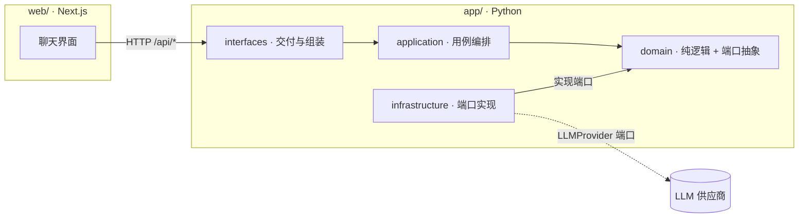

# MoonInsight


金融助手 Agent —— 以 AI Agent 形态提供金融助手能力的参考级实现。

## 架构



## 技术栈

- Python 3.12 + FastAPI + OpenAI SDK（模型是配置项，首例 DeepSeek）
- Next.js 16 + TypeScript（前后端同仓库，dev 代理免 CORS）
- 工具链：uv + pnpm + pytest

## 快速开始

### 初始配置（仅第一次）

```bash
# 后端（app/ 目录）
cd app
cp .env.example .env          # 填入 LLM_API_KEY
uv sync                       # 安装后端依赖

# 前端（web/ 目录）
cd ../web && pnpm install     # 安装前端依赖
```

### 日常运行（每次开发）

```bash
# 后端（app/ 目录）
cd app && uv run --env-file .env uvicorn moon_insight.interfaces.main:app --port 8000

# 前端（另开终端，web/ 目录）
cd web && pnpm dev
# 打开 http://localhost:5173

# 测试（app/ 目录）
cd app && uv run pytest       # fake 注入测试零成本；真实 LLM 测试需配置 LLM_API_KEY
```

## 免责声明

本项目仅用于研究与学习，不构成任何投资建议。
